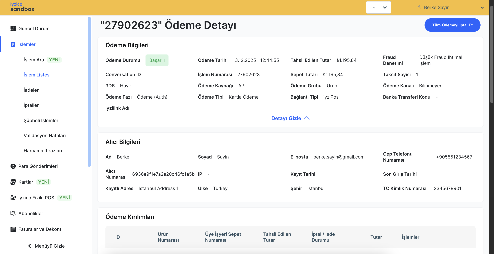
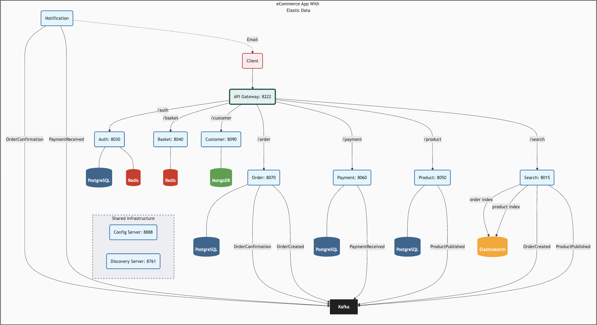
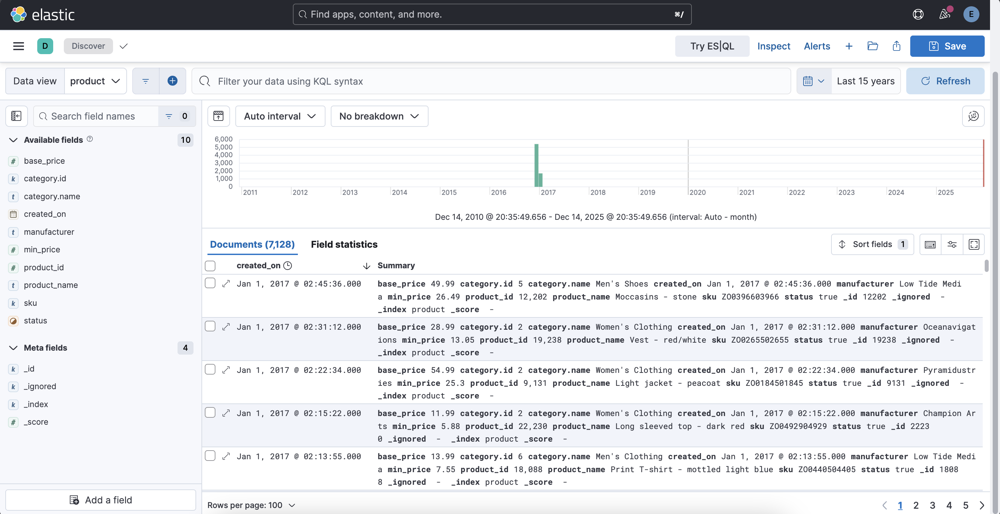

# eCommerce Application With Elastic Data And iyzico Payment

The `shopping app` is designed using `Microservices` architecture and `API Gateway` pattern where each service is responsible for a specific business function. 

`iyipay-java` API client developed by `iyzico` is integrated and used for the project at the `payment` service.

`Reference`: https://github.com/iyzico/iyzipay-java

`Architectural Diagram`

`Elasticsearch` &rarr; `product` index as example

### Technologies  

Software architectures and principles:
- `Microservices`
- `API gateway`
- `Distributed systems`
- `Domain driven design`

Technologies:
- `Java 21`
- `Spring Boot v.3.3.1`
- `Spring Security`
- `Maven`
- `GitHub Actions`
- `Elasticsearch`
- `Kibana`
- `Elastic Agent` and `Fleet Server`
- `Elastic APM` and `OpenTelemetry`
- `Docker Compose`
- `PostgreSQL`
- `MongoDB`
- `Redis`
- `Kafka`

### Documentation

Refer to the `docs` section for `setup` and `development` of the project. It includes these parts:

- [Get API Key for iyzipay Java Client](https://github.com/berkesayin/shopping-app-microservices/blob/master/docs/1.1.IYZIPAY_API_KEY.md)
- [Set Up Environment Variables](https://github.com/berkesayin/shopping-app-microservices/blob/master/docs/1.2.ENVIRONMENT_VARIABLES.md)
- [Run Docker Containers](https://github.com/berkesayin/shopping-app-microservices/blob/master/docs/1.3.DOCKER_COMPOSE_SERVICES.md)
- [Run Elasticsearch and Kibana](https://github.com/berkesayin/shopping-app-microservices/blob/master/docs/2.1.ELASTICSEARCH_KIBANA_SETUP.md)
  - [Set up Elasticsearch and Kibana](https://github.com/berkesayin/shopping-app-microservices/blob/master/docs/2.1.ELASTICSEARCH_KIBANA_SETUP.md)
  - [Get Elastic's Sample eCommerce Data](https://github.com/berkesayin/shopping-app-microservices/blob/master/docs/2.2.ECOMMERCE_DATA_ELASTIC.md)
  - [Get Product Data for Elasticsearch](https://github.com/berkesayin/shopping-app-microservices/blob/master/docs/2.3.PRODUCT_DATA_ELASTICSEARCH.md)
  - [Get Category Data for Elasticsearch](https://github.com/berkesayin/shopping-app-microservices/blob/master/docs/2.4.CATEGORY_DATA_ELASTICSEARCH.md)
  - [Get Product Data for PostgreSQL](https://github.com/berkesayin/shopping-app-microservices/blob/master/docs/2.5.PRODUCT_DATA_POSTGRESQL.md)
  - [Get Customer Data](https://github.com/berkesayin/shopping-app-microservices/blob/master/docs/2.6.CUSTOMER_DATA.md)
  - [Create Order Index at Elasticsearch](https://github.com/berkesayin/shopping-app-microservices/blob/master/docs/2.7.ORDER_INDEX_ELASTICSEARCH.md)
  - [Go to Kibana Index Management](https://github.com/berkesayin/shopping-app-microservices/blob/master/docs/2.8.INDEX_MANAGEMENT_KIBANA.md)
- [Use Kibana Observability](https://github.com/berkesayin/shopping-app-microservices/blob/master/docs/4.1.FLEET_SERVER_ELASTIC_AGENT.md)
  - [Set Up Fleet Server and Elastic Agent](https://github.com/berkesayin/shopping-app-microservices/blob/master/docs/4.1.FLEET_SERVER_ELASTIC_AGENT.md)
  - [Add Kibana's Docker Integration](https://github.com/berkesayin/shopping-app-microservices/blob/master/docs/4.2.KIBANA_INTEGRATIONS_DOCKER.md)
  - [Add Kibana's Redis Integration](https://github.com/berkesayin/shopping-app-microservices/blob/master/docs/4.3.KIBANA_INTEGRATIONS_REDIS.md)
  - [Use Elastic APM (Application Performance Monitoring)](https://github.com/berkesayin/shopping-app-microservices/blob/master/docs/4.4.ELASTIC_APM.md)
  - [Use OpenTelemetry](https://github.com/berkesayin/shopping-app-microservices/blob/master/docs/4.5.OPEN_TELEMETRY.md)
- [Backend services](https://github.com/berkesayin/shopping-app-microservices/tree/master/services)
  - [auth](https://github.com/berkesayin/shopping-app-microservices/tree/master/services/auth)
  - [basket](https://github.com/berkesayin/shopping-app-microservices/tree/master/services/basket)
  - [config-server](https://github.com/berkesayin/shopping-app-microservices/tree/master/services/config-server)
  - [customer](https://github.com/berkesayin/shopping-app-microservices/tree/master/services/customer)
  - [discovery](https://github.com/berkesayin/shopping-app-microservices/tree/master/services/discovery)
  - [gateway](https://github.com/berkesayin/shopping-app-microservices/tree/master/services/gateway)
  - [notification](https://github.com/berkesayin/shopping-app-microservices/tree/master/services/notification)
  - [order](https://github.com/berkesayin/shopping-app-microservices/tree/master/services/order)
  - [payment](https://github.com/berkesayin/shopping-app-microservices/tree/master/services/payment)
  - [product](https://github.com/berkesayin/shopping-app-microservices/tree/master/services/product)
  - [search](https://github.com/berkesayin/shopping-app-microservices/tree/master/services/search)

