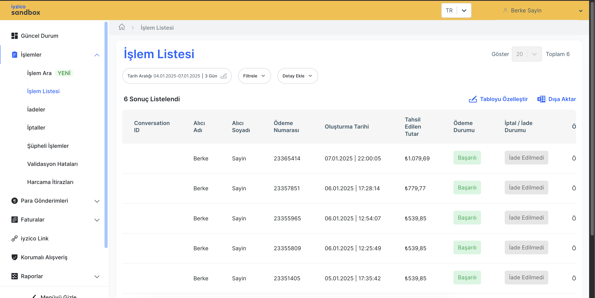

# Microservices Shopping Backend Application

The shopping application is designed using microservices architecture, where each service is responsible for a specific business function. This method promotes loosely coupling and separation of concerns principles, allows for independent scaling, and facilitates faster development cycles.

## Iyzico Payment

`iyzico, iyzipay-java` package is used with maven at payment service to process and handle customer, order, and payment operations.

```xml
<dependency>
  <groupId>com.iyzipay</groupId>
  <artifactId>iyzipay-java</artifactId>
  <version>2.0.132</version>
</dependency>
```
*   **Library:** `iyzipay-java` is included as a dependency for the payment microservice.
*   **Configuration:** The iyzico API keys and secret keys are managed through the config-server, enabling externalized configuration.
*   **Functionality:** The payment service handles operations such as:
    *   Creating payment request.
    *   Managing payment cards.
    *   Handling customer data coming from customer service.
    *   Communicating with basket service to process basket products.

**Reference:** https://github.com/iyzico/iyzipay-java

### Services

The following microservices are included in this project:

*   **Config server:** Manages the configuration of other services.
*   **Discovery server:**  Enables service discovery for other microservices.
*   **Customer:** Handles customer data and operations.
*   **Product:** Manages product catalog and related functionalities.
*   **Basket:** Handles user shopping carts and related operations.
*   **Order:** Manages order processing, status, and history.
*   **Payment:** Manages payment processing using `iyzico's iyzipay-java` package.
*   **Notification:**  Manages notifications to users (order and payment confirmation).
*   **Gateway:** The entry point for the application, routing requests to the appropriate services.

## Technology Stack

The following technologies were used during the development of this project:

*   **Programming Language:** Java 21
*   **Framework:** Spring Boot - v3.4.1
*   **API Gateway (Spring Cloud Gateway):** For routing and API management.
*   **Containerization:** Docker
*   **Container Orchestration:** Kubernetes
*   **Build Tool:** Maven
*   **CI/CD:** GitHub Workflows
*   **Databases:**
    *   **PostgreSQL:** Relational database for structured data.
    *   **MongoDB:** NoSQL database for flexible data storage at customer and notification services.
    *   **Redis:** Key-value data store for basket operations.
*   **Messaging:**
    *   **Kafka:**  For asynchronous messaging and event-driven architecture. Mostly used in payment and order confirmation.
    *   **Open Feign:** For synchronous communication between services.


## Business Flow

The typical business flow for a user shopping on the platform would follow these steps:

1.  **Browsing Products:** The user navigates the product catalog via the `gateway`, which interacts with the `product` service.
2.  **Adding to Basket:** The user adds products to their basket; this data is managed by the `basket` service.
3.  **Order:**  When the user proceeds to checkout, the `order` service is engaged to create a new order record.
4.  **Payment:** The `payment` service handles the payment process using the `iyzico API`.  This interaction is crucial for completing the purchase.
5.  **Order Confirmation:** Once the payment is successful, the `order` service updates the order status.
6.  **Notification:** The `notification` service sends notifications to the user via `devmail` defined at `docker-compose` about order or payment confirmation.
7.  **Service Communication:** All communication within the system occurs via:
    *   Synchronous requests through Open Feign for direct communication.
    *   Asynchronous events through Kafka for processes that don't require immediate responses.
8.  **Discovery:**  The services are able to discover each other via discovery service.

* Register
* Browse all products or browse them by categories
* Add item to basket
* Check total basket price
* Add/update credit card
* Proceed to checkout (order)
* Create order 

POST   http://localhost:8222/api/v1/orders
```json
{
  "reference": "ORD-20241027-1",
  "customerId": "677d77b7bfe40551dd28b0d1",
  "paymentMethod": "IYZICO_PAYMENT"
}
```

Transactions: https://sandbox-merchant.iyzipay.com/transactions



Payment details: https://sandbox-merchant.iyzipay.com/transactions/23365414


Payment status: https://sandbox-merchant.iyzipay.com/transactions/23365414


## Running Application

To run this application locally, you will need the following:

1.  **Java and Build Tools:** Make sure you have Java and build tools installed.
2.  **Docker:** Install Docker and Docker Compose.
3.  **PostgreSQL, MongoDB:** Make sure you have these installed and running, or Docker containers.
4.  **Redis, Kafka:** Make sure you have redis and kafka installed and running.
5.  **iyzico API Keys:** You'll need your iyzico API and secret keys.

Load maven projects for each service

```sh
./mvnw clean install
./mvnw spring-boot:run
```

## Basket Data With Redis


## Postman Collection

Postman collection is included at the root directory of repository.


## New Features 

These features will be released soon:

- Adding Redis cache for frequently accessed endpoints
- Implementing spring security
- Using Helm charts for kubernetes deployments
- Applying container orchestration best practices
- Adding consumer at notification service to consume order-topic and payment-topic
- Updating CI/CD pipelines to run linting, static analysis tools and tests.