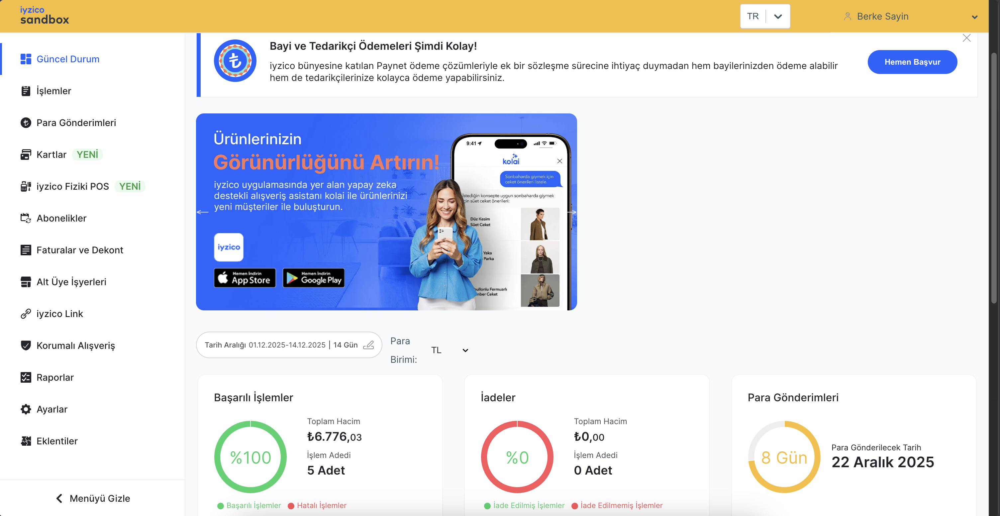

# Iyzipay API Key and Environment Variables

`iyizpay` API Java client developed by `iyzico` is used at `payment` service. `iyzico's Developer Portal` serves as your gateway to effortlessly incorporating online payments into your business.

Example from [Iyzico Sanbox Environment](https://sandbox-merchant.iyzipay.com/dashboard)

- `GitHub` Repository: https://github.com/iyzico/iyzipay-java
- `Iyzico` Docs: https://docs.iyzico.com/on-hazirliklar/sandbox

### Get Iyzipay API Key And Secret Key 

This is a short explanation to get `API Key` and `Secret Key` for `iyzico sandbox` environment. But keep in mind that it is always best practice to refer to the official docs for any updates.

https://docs.iyzico.com/on-hazirliklar/sandbox

- To get an `iyzipay` API Key and a Secret Key, [register](https://sandbox-merchant.iyzipay.com/auth/register) for `iyzico sandbox` environment. 
- [Login](https://sandbox-merchant.iyzipay.com/auth/login) with your account. 
- Use `123456` for SMS message verifications.
- At the left menu, go to `Ayarlar(Settings)` &rarr; `Firma Ayarları (Merchant Settings)`. 
- Get `API Key` and `Secret Key` values there.
