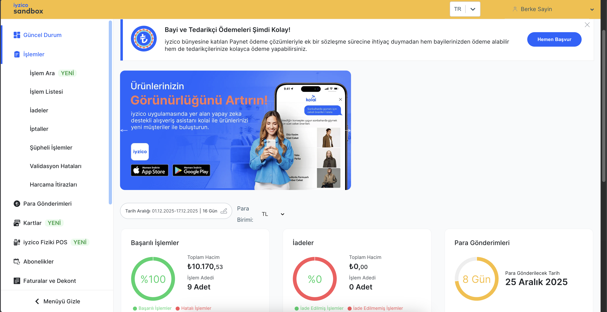
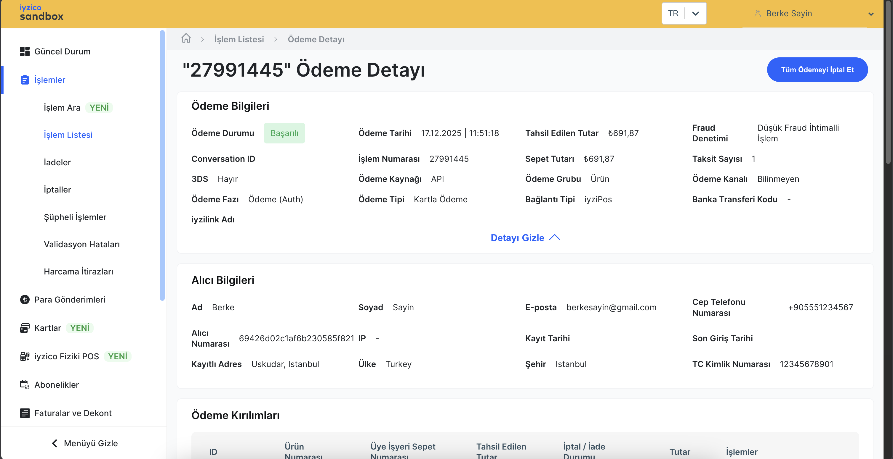
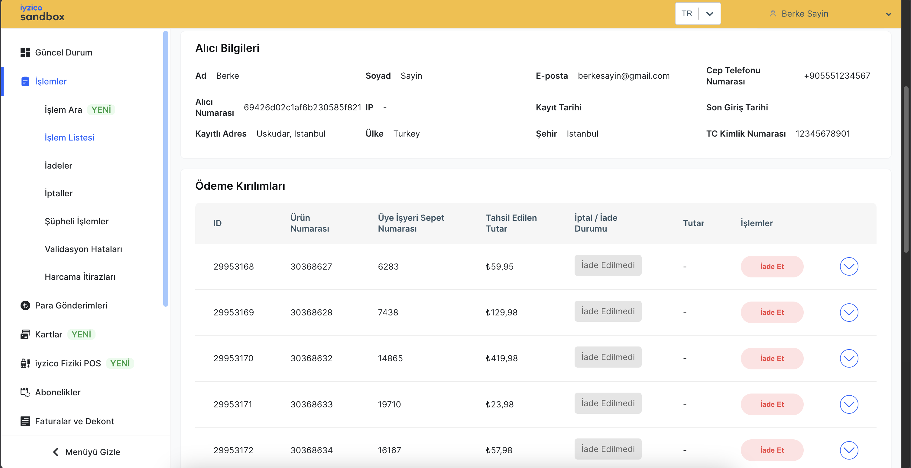
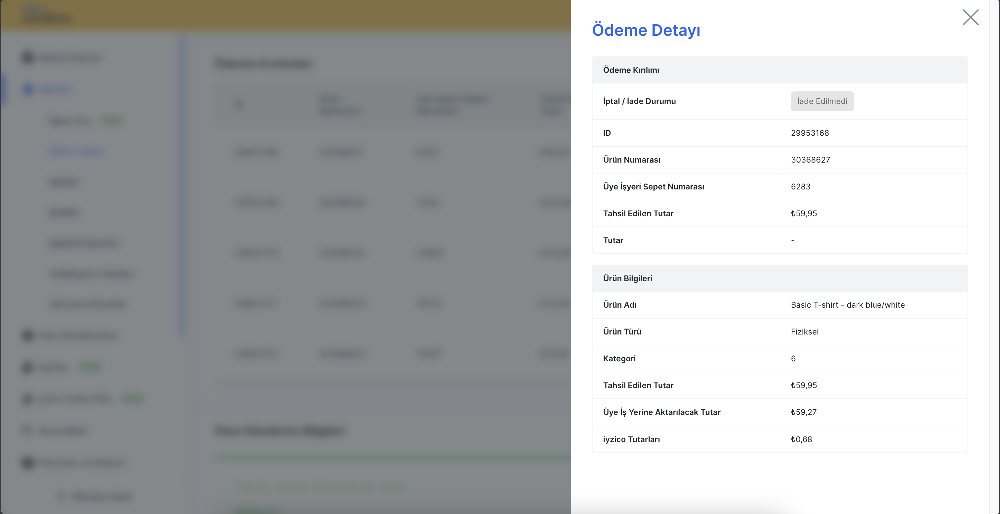

# Use iyzico Sandbox Environment for Order Details

`iyizpay` API Java client developed by `iyzico` is used at `payment` service. `iyzico's Developer Portal` serves as your gateway to effortlessly incorporating online payments into your business.

- `GitHub` Repository: https://github.com/iyzico/iyzipay-java
- `Iyzico` Docs: https://docs.iyzico.com/on-hazirliklar/sandbox

Examples from [Iyzico Sanbox Environment](https://sandbox-merchant.iyzipay.com/dashboard)

`Dashboard`

`Payment Details for an Order`

`Payment Transaction for an Order`

`Payment Details for an Order Item`

`iyzico Sandbox Environment` also provides other details for `orders`, `refunds`, `payment details`, `buyer info` and other `transactions`. It can be set up, integrated and used easily with its docs.