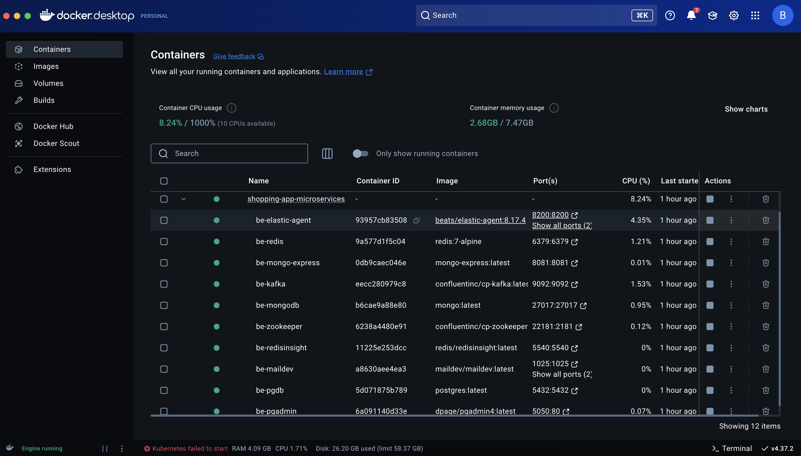
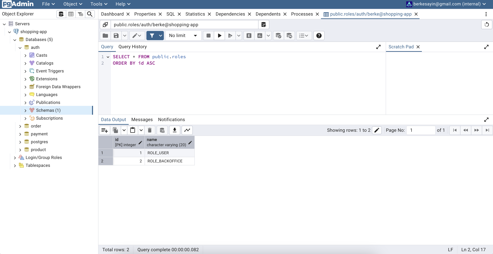
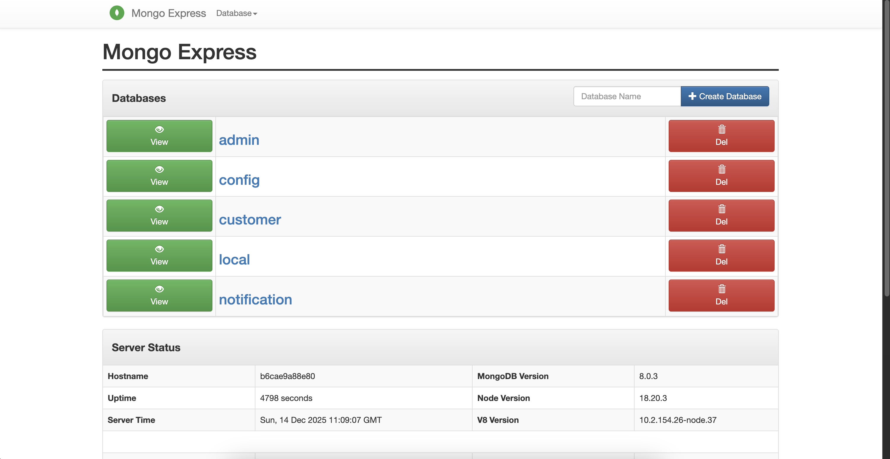
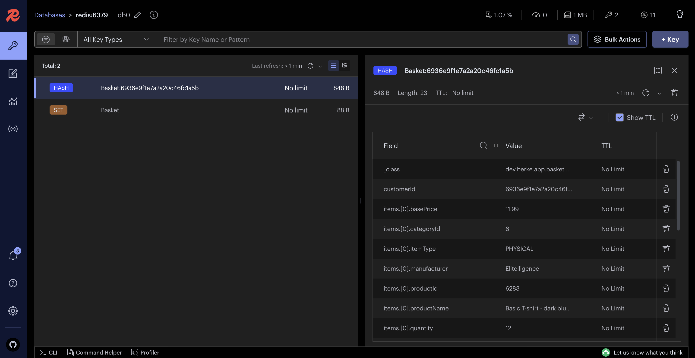
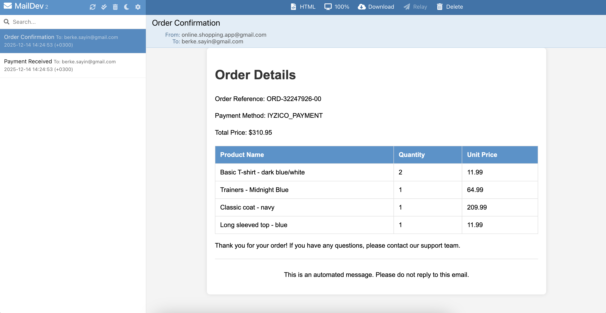

# Services Running With Docker Compose

This project uses hybrid setup. `Elasticsearch and Kibana` is downloaded on host system. Other `infrastrucure` and `database` tools run on `Docker` with `Docker Compose` configuration.
- `PostgreSQL`
- `PGAdmin`
- `MongoDB`
- `Mongo Express`
- `Zookeeper`
- `Kafka`
- `MailDev`
- `Redis`
- `Redis Insight`
- `Elastic Agent`

`Elastic Agent` is commented out at the beginning. Uncomment it and build `compose` services again when you setup `Elasticsearch`, `Kibana`, and `Fleet Server` in later docs.

### Build And Run Compose Services

[Get Docker Desktop](https://www.docker.com/products/docker-desktop/) which runs `Docker Engine`.

Locate the project directory where `docker-compose.yml` exists. And run this command:

```sh 
docker compose up --build
```

Open `Docker Desktop Dashboard`.



### UI Tools

These `UI tools` provide UI functionalities for these `infrastructure` and `database` tools.
- `PGAdmin` &rarr; `PostgreSQL`
- `Mongo Express` &rarr; `MongoDB`
- `Redis Insight` &rarr; `Redis`
- `DevMail`

### PGAdmin

`PGAdmin`: http://localhost:5050



Login with your `PGADMIN_DEFAULT_EMAIL` and `PGADMIN_DEFAULT_PASSWORD` values.

Create new server:
- `General` &rarr; `Name`: `shopping-app`
- `Connection` &rarr; `Host Name`: `postgres`
- `Connection` &rarr; `Port`: `5432`
- `Connection` &rarr; `Maintanance Database`: `postgres`
- `Connection` &rarr; `Username`: `POSTGRES_USER`
- `Connection` &rarr; `Password`: `POSTGRES_PASSWORD`

At this `shopping-app` server, create databases with these names:
- `auth`
- `order`
- `payment`

`Product` service's `product` database also uses `PostgreSQL`, but it creates the database when `product` service is built and run.

When `auth` service is run, one of the tables created is `roles`. Run these `sql` commands for that:

```sql 
INSERT INTO roles(name) VALUES('ROLE_USER');
INSERT INTO roles(name) VALUES('ROLE_BACKOFFICE');
```

### Mongo Express 

`Mongo Express`: http://localhost:8081



Login with your `ME_CONFIG_BASICAUTH_USERNAME` and `ME_CONFIG_BASICAUTH_PASSWORD` values.

`Customer` service and `notification` service use `MongoDB`. Their databases are created when they are built and run.

### Redis Insight

`Redis Insight`: http://localhost:5540



`Basket` service and `auth` service use `Redis`.

Click `Add Redis Database`.
- `Host`: `redis`
- `Port`: `6379`
- `Database Alias`: `redis:6379`

### DevMail

`DevMail`: http://localhost:5540



`Notification` service consumes from `order-topic` and `payment-topic` when `order` and `payment` are successful. And it sends mail to the customer with `Order Confirmation` and `Payment Received` titles.