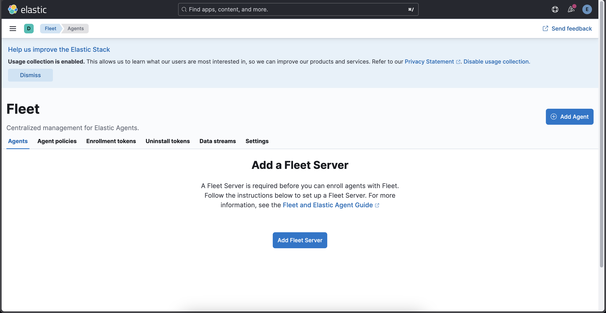
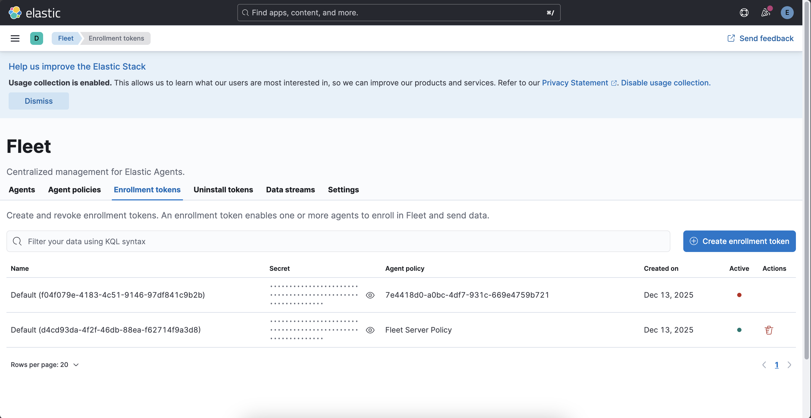
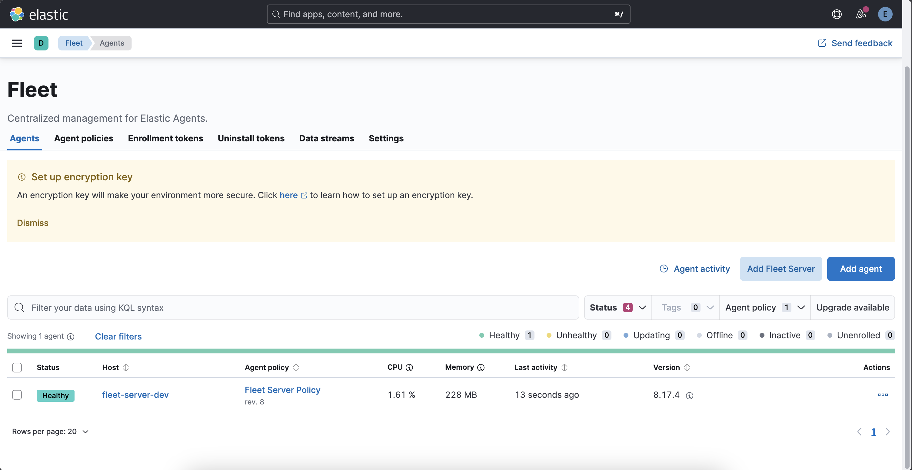

# Fleet And Elastic Agent

For the project `Fleet Server` and `Elastic Agent` are used to collect `logs` and `metrics`.

- Hybrid setup is used for project's needs. 
  - `Elasticsearch` and `Kibana` are downloaded on host system.
  - Infrastructure and database tools including `Kafka`, `Redis`, `PostgreSQL`, `MongoDB` run on `Docker` with `Compose` configuration. 
  - It is good practice to also run `Elastic Agent` on `Docker`.

Add `Fleet Server` for the project. For that go to `Kibana Server` &rarr; `Management` &rarr; `Fleet`. 



### Elastic Agent

- `Elastic Agent` is a single, unified way to add monitoring for logs, metrics, and other types of data to a host.
- It can also protect hosts from security threats, query data from operating systems, forward data from remote services or hardware, and more. 
- A single `agent` makes it easier and faster to deploy monitoring across infrastructure. 
- Each `agent` has a single policy that can be updated to add `integrations` for new data sources, security protections, and more.

### Fleet 

- `Fleet` provides a web-based UI in `Kibana` for centrally managing `Elastic Agents` and their `policies`.
- `Fleet Server` is the mechanism to connect `Elastic Agents` to `Fleet`.  
- All communication between the `Fleet UI` and `Fleet Server` happens through `Elasticsearch`. 
- `Fleet` writes policies, actions, and any changes to the `fleet-*` indices in `Elasticsearch`. 
- Each `Fleet Server` monitors the indices, picks up changes, and ships them to the `Elastic Agents`. 

So, `Fleet Server` is manager, and `Elastic Agent` is for data collection.

### Set Up Elastic Agent and Fleet Server 

For that go to `Kibana Server` &rarr; `Management` &rarr; `Fleet`  &rarr; `Add Agent`  &rarr; `Enroll in Fleet`  &rarr; `Add Fleet Server`  &rarr; `Quick Start` 

- Name: `fleet-server-dev`
- URL: `https://elastic-agent:8220`

`elastic-agent` is the service name for `Elastic Agent` in `Docker Compose` configuration.

Then, click `Generate Fleet Server policy`. With this, `Fleet Server Policy` and `Service Token` are generated. 

### Install Fleet Server To A Centralized Host 

`Elastic Agent` is configured here to run on `Docker`.

At `Fleet Server`, it displays this command which is used to download `Elastic Agent` on `MacOS` host system. Do not run this command. Just copy the `fleet_server_service_token` value.

```sh 
curl -L -O https://artifacts.elastic.co/downloads/beats/elastic-agent/elastic-agent-8.17.4-darwin-aarch64.tar.gz
tar xzvf elastic-agent-8.17.4-darwin-aarch64.tar.gz
cd elastic-agent-8.17.4-darwin-aarch64
sudo ./elastic-agent install \
  --fleet-server-es=https://localhost:9200 \
  --fleet-server-service-token=<fleet_server_service_token> \
  --fleet-server-policy=fleet-server-policy \
  --fleet-server-es-ca-trusted-fingerprint=<fleet_server_es_ca_trusted_fingerprint> \
  --fleet-server-port=8220
```

Get `fleet_server_service_token` value. Then, go to `Enrollment tokens` tab. 



Get the `secret` value for agent policy named `Fleet Server Policy`. It will be used as `ENROLLMENT_TOKEN` value at `compose`.

Add these values to your `.env` file.

- `FLEET_SERVER_SERVICE_TOKEN`=`<your_fleet_server_service_token>`
- `FLEET_ENROLLMENT_TOKEN`=`<your_fleet_enrollment_token>`

### Fleet Server Settings  

- Fleet server hosts (`agents` use to connect):
  - Name: `fleet-server-dev`
  - Host URLs: `https://elastic-agent:8220`

- Outputs (where `agents` will send data):
  - Name: `default` 
  - Type: `Elasticsearch`
  - Hosts: `https://172.20.10.2:9200`
  - Default: `agent integrations`, `agent monitoring`

### Run Elastic Agent With Docker Compose 

This is the `Docker Compose` configuration to run `Elastic Agent`.

```yml 
  elastic-agent:
    image: docker.elastic.co/beats/elastic-agent:8.17.4 
    container_name: be-elastic-agent
    hostname: fleet-server-dev
    restart: unless-stopped
    privileged: true 
    user: root 
    ports:
      - "8220:8220" # Fleet Server port
      - "8200:8200" # APM Port (for Spring Boot APM Agent)
    environment:
      FLEET_SERVER_ENABLE: "1"
      FLEET_SERVER_POLICY_ID: "fleet-server-policy" 
      FLEET_SERVER_SERVICE_TOKEN: ${FLEET_SERVER_SERVICE_TOKEN}
      FLEET_SERVER_ELASTICSEARCH_HOST: "https://host.docker.internal:9200"
      FLEET_SERVER_ELASTICSEARCH_INSECURE: "true" # for dev only, ignore mismatch for 'localhost' cert and 'host.docker.internal' address
      FLEET_SERVER_PORT: 8220
      FLEET_SERVER_HOST: "0.0.0.0"   
      FLEET_INSECURE: "true" # for dev only
      FLEET_URL: "https://localhost:8220"
      FLEET_ENROLL: "1"
      FLEET_ENROLLMENT_TOKEN: ${FLEET_ENROLLMENT_TOKEN}
    volumes:
      - /var/run/docker.sock:/var/run/docker.sock:ro # container metrics 
    networks:
      - be-net
    extra_hosts:
      - "host.docker.internal:host-gateway" # map 'host.docker.internal' to macOS actual IP
```

Stop and re-run containers with `docker compose up --build`

After `be-elastic-agent` containers starts running, the `Agent` enrolls in `Fleet Server`.


