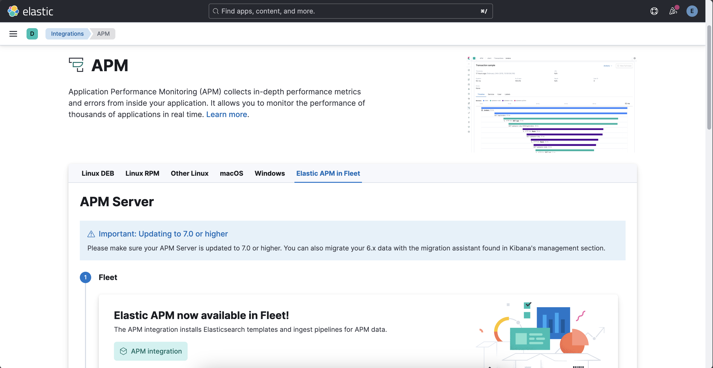
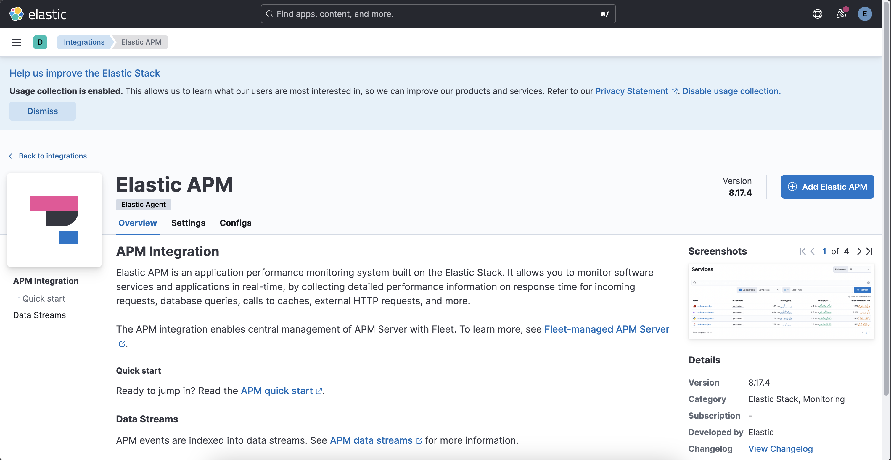
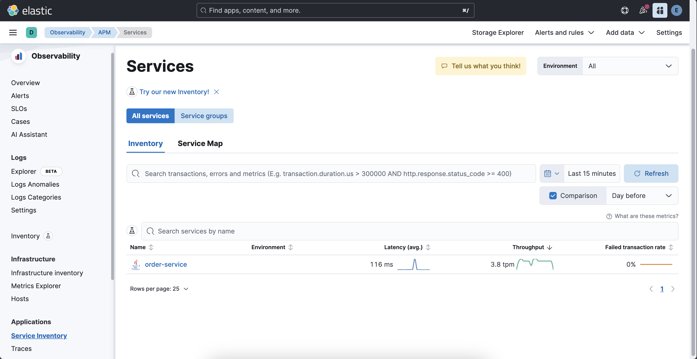
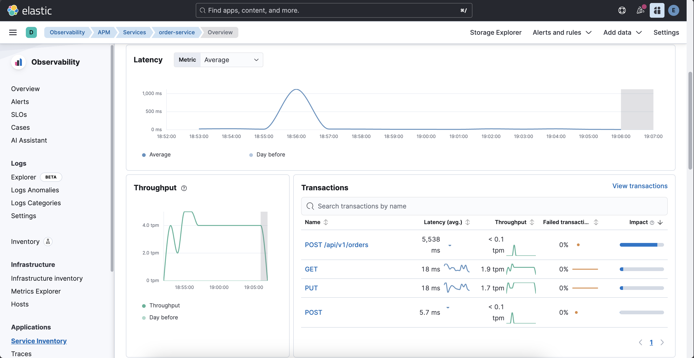
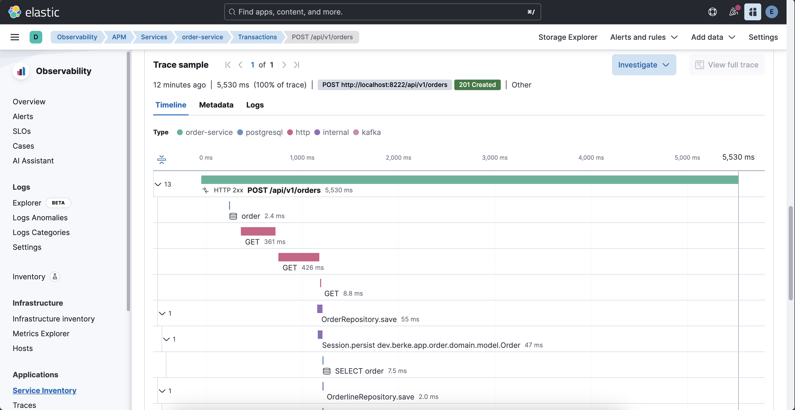
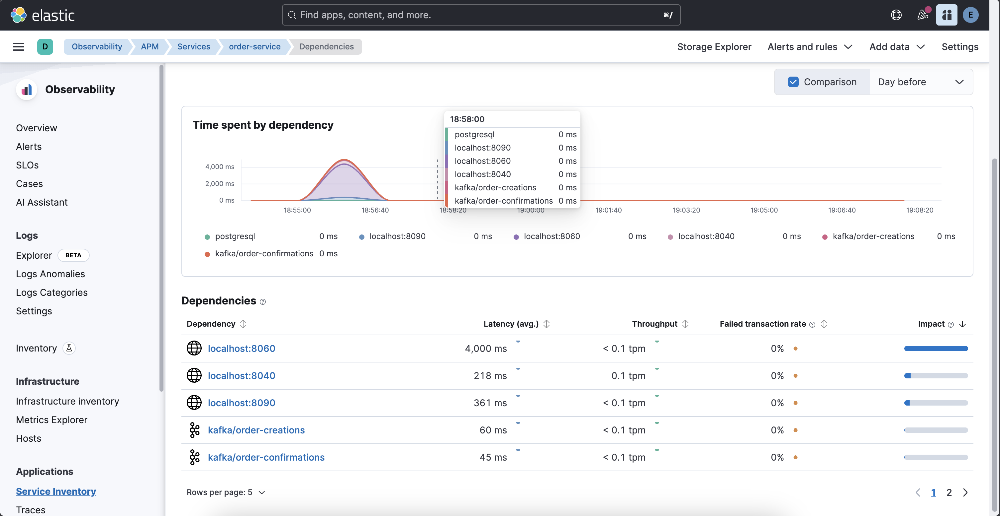

# Elastic APM and OpenTelemetry

For that, go to `Kibana Server` &rarr; `Management` &rarr; `Fleet`. The `agent policy` for our running `Elastic Agent` instance is `Fleet Server Policy`. Open it. Click `Add Integration`. Search for `Elastic APM`.



Select `APM Integration` for `Fleet`. And then select `Add Elastic APM`. 



### OpenTelemetry Instrumentation for Java

Go to the [repository](https://github.com/open-telemetry/opentelemetry-java-instrumentation). Then, search for the `download` and click `Download the latest version` there.

This downloads `opentelemetry-javaagent.jar` to the path you prefer. 

Then, open the project at `Intellij Idea`. Select `Edit Run/Debug Configurations` at the top toolbar. On the left side, select `OrderApplication`. 

Click `Modify Options` there and select `Add VM Options`. Paste the configuration there:

```sh
-javaagent:/path/to/your/opentelemetry-javaagent.jar -Dotel.resource.attributes=service.name=order-service -Dotel.exporter.otlp.endpoint=http://localhost:8200 -Dotel.exporter.otlp.protocol=http/protobuf -Dotel.metrics.exporter=otlp -Dotel.logs.exporter=otlp
```

Save changes and re-run `order service`. It displays this log.

`[otel.javaagent 2025-12-13 18:55:02:179 +0300] [main] INFO io.opentelemetry.javaagent.tooling.VersionLogger - opentelemetry-javaagent - version: 2.23.0`

Trigger `createOrder` or any other endpoint at `order` service. Go to `Kibana` &rarr; `Menu` &rarr; `Observability` &rarr; `APM`.

`order-service` is listed here. 



`Overview` for `order` service.



`Transactions` for `order` service.



`Dependencies` for `order` service.


