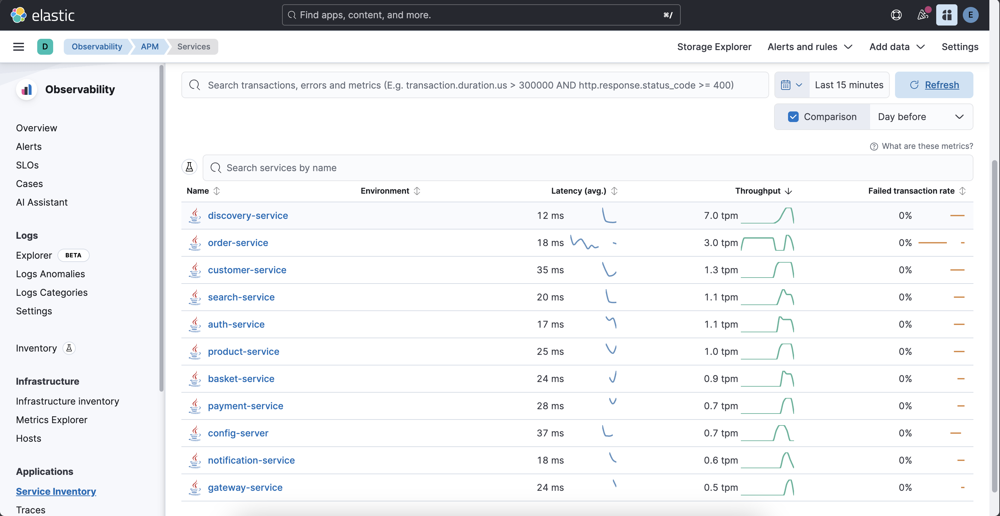

# Elastic APM and OpenTelemetry

### OpenTelemetry Instrumentation for Java

`opentelemetry-javaagent.jar` is downloaded at previous step. 

### Edit Configurations For All Services

Add `OpenTelemetry Instrumentation for Java` for all services. Select `Edit Run/Debug Configurations` at the top toolbar for each service. 

Use these service names for each service: 

- `auth-service`
- `basket-service`
- `config-server`
- `customer-service`
- `discovery-service`
- `gateway-service`
- `notification-service`
- `payment-service`
- `product-service`
- `search-service`

Select `AuthApplication` &rarr; `Modify Options` &rarr; `Add VM Options`.

Paste the configuration there:

```sh
-javaagent:/path/to/your/opentelemetry-javaagent.jar -Dotel.resource.attributes=service.name=<service_name> -Dotel.exporter.otlp.endpoint=http://localhost:8200 -Dotel.exporter.otlp.protocol=http/protobuf -Dotel.metrics.exporter=otlp -Dotel.logs.exporter=otlp
```

This command is specific for service names. Use the `service names` above for each service.

`-Dotel.resource.attributes=service.name=<service_name>`

Then re-run all services. 

Trigger some endpoints at services. Go to `Kibana` &rarr; `Menu` &rarr; `Observability` &rarr; `APM`.

