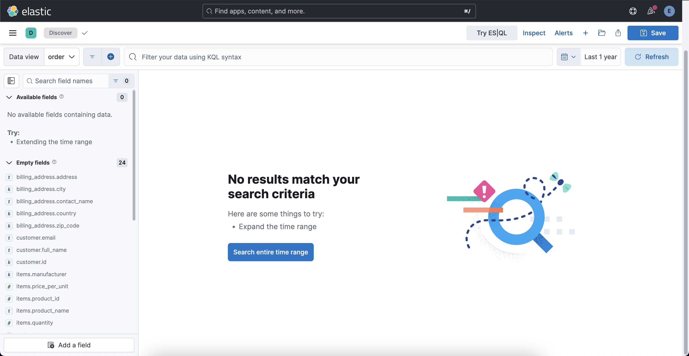

# Order Index At Elasticsearch

Elasticsearch's search and analysis functinalities are quite useful to keep `order` index there and visualize results from orders data. 



### Create Order Index 

Open `Kibana Server` &rarr; `Management` &rarr; `Dev Tools` and run this command.

```json 
PUT /order
{
  "settings": {
    "number_of_shards": 1,
    "number_of_replicas": 1,
    "analysis": {
      "analyzer": {
        "email_analyzer": {
          "type": "custom",
          "tokenizer": "uax_url_email"
        },
        "default": {
          "type": "standard"
        }
      }
    }
  },
  "mappings": {
    "dynamic": "strict",
    "properties": {
      "billing_address": {
        "properties": {
          "address": {
            "type": "text"
          },
          "city": {
            "type": "keyword"
          },
          "contact_name": {
            "type": "text"
          },
          "country": {
            "type": "keyword"
          },
          "zip_code": {
            "type": "keyword"
          }
        }
      },
      "customer": {
        "properties": {
          "email": {
            "type": "text",
            "analyzer": "email_analyzer",
            "fields": {
              "keyword": {
                "type": "keyword"
              }
            }
          },
          "full_name": {
            "type": "text",
            "fields": {
              "keyword": {
                "type": "keyword"
              }
            }
          },
          "id": {
            "type": "keyword"
          }
        }
      },
      "items": {
        "type": "nested",
        "properties": {
          "manufacturer": {
            "type": "keyword"
          },
          "price_per_unit": {
            "type": "scaled_float",
            "scaling_factor": 100
          },
          "product_id": {
            "type": "integer"
          },
          "product_name": {
            "type": "text",
            "fields": {
              "keyword": {
                "type": "keyword"
              }
            }
          },
          "quantity": {
            "type": "integer"
          }
        }
      },
      "order_date": {
        "type": "date"
      },
      "order_id": {
        "type": "keyword"
      },
      "payment_method": {
        "type": "keyword"
      },
      "reference": {
        "type": "keyword"
      },
      "shipping_address": {
        "properties": {
          "address": {
            "type": "text"
          },
          "city": {
            "type": "keyword"
          },
          "contact_name": {
            "type": "text"
          },
          "country": {
            "type": "keyword"
          },
          "zip_code": {
            "type": "keyword"
          }
        }
      },
      "status": {
        "type": "keyword"
      },
      "total_amount": {
        "type": "scaled_float",
        "scaling_factor": 100
      }
    }
  }
}
```

Response:

```json 
{
  "acknowledged": true,
  "shards_acknowledged": true,
  "index": "order"
}
```

Add `Data View` for this `order` index. For that go to `Kibana Server` &rarr; `Discover`. And create a new `Data View` here:

- Name: `order`
- Index pattern: `order` 
- Timestamp field: `order_date` 

These are fields for `order` index:

- billing_address.address
- billing_address.city 
- billing_address.contact_name 
- billing_address.country 
- billing_address.zip_code 
- customer.email
- customer.full_name
- customer.id
- items.manufacturer 
- items.price_per_unit
- items.product_id 
- items.product_name 
- items.quantity
- order_date
- order_id
- payment_method
- reference 
- shipping_address.address
- shipping_address.city 
- shipping_address.contact_name 
- shipping_address.country 
- shipping_address.zip_code 
- status
- total_amount

Meta fields: 

- _id 
- _ignored 
- _index 
- _score

