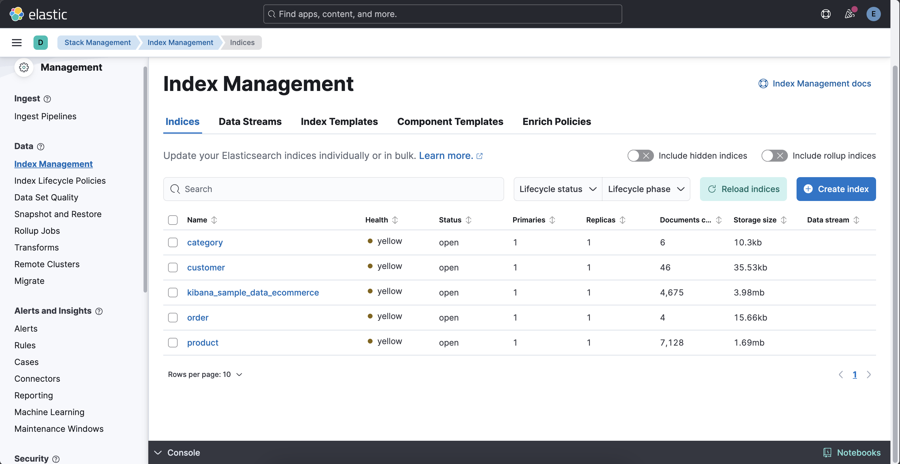
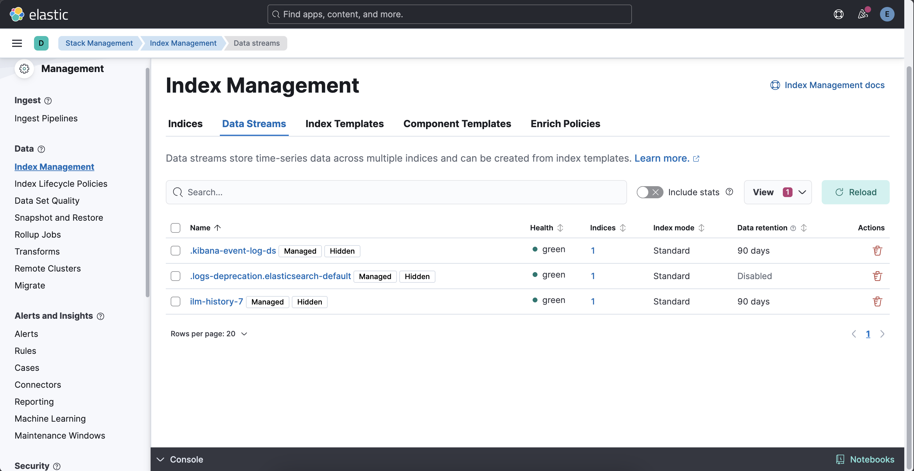
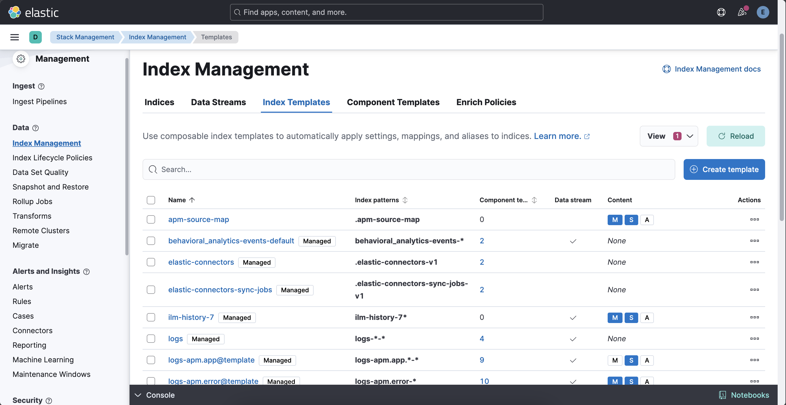
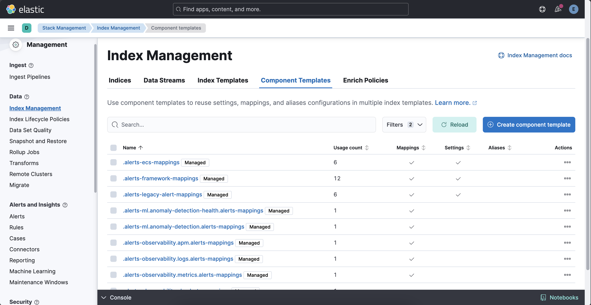
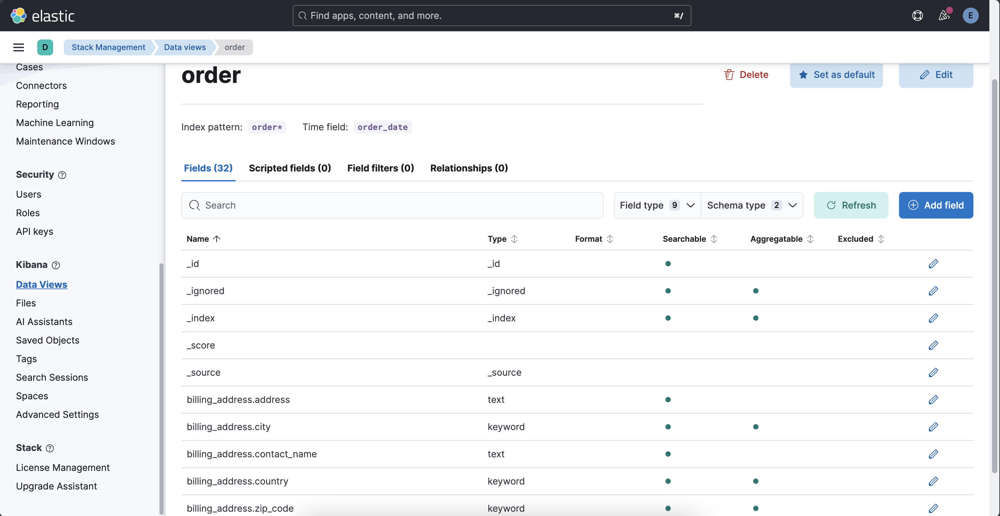

# Index Management At Kibana

`Elasticsearch` is a distributed search and analytics engine, scalable data store, and vector database built on `Apache Lucene`.

An `index` is a fundamental unit of storage in `Elasticsearch`. It is a collection of documents uniquely identified by a name or an alias.

This part displays `Index Management` section at `Kibana Server`. For that, go to `Menu` &rarr; `Management` &rarr; `Stack Management`. 

This menu includes management settings and configurations for `Ingest`, `Data`, `Alerts and Insight`, `Security`, `Kibana`, and `Stack`. 

### Index Management: Indices 

These are indices for now.

- category 
- customer (optional)
- order
- product

### Index Management: Data Streams 

### Index Management: Index Templates  

### Index Management: Component Templates

### Kibana Data Views 

### Kibana Order Data View

