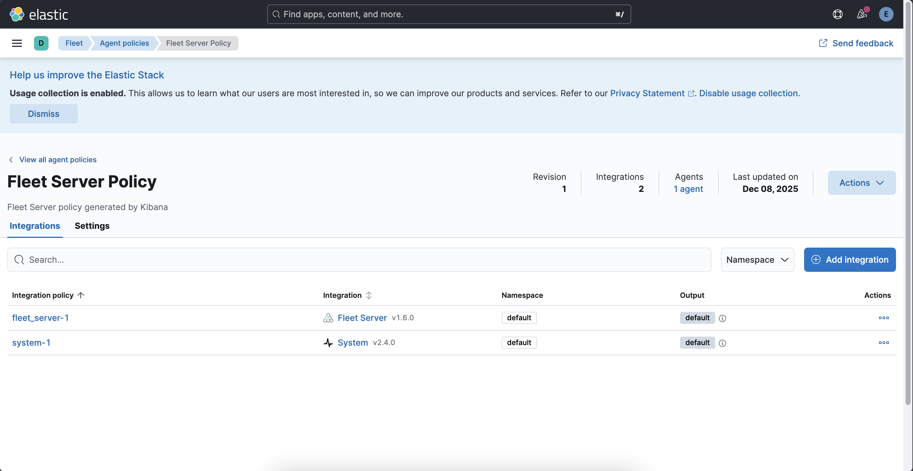
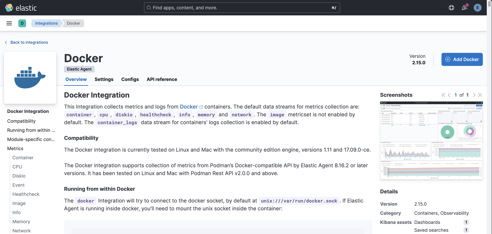
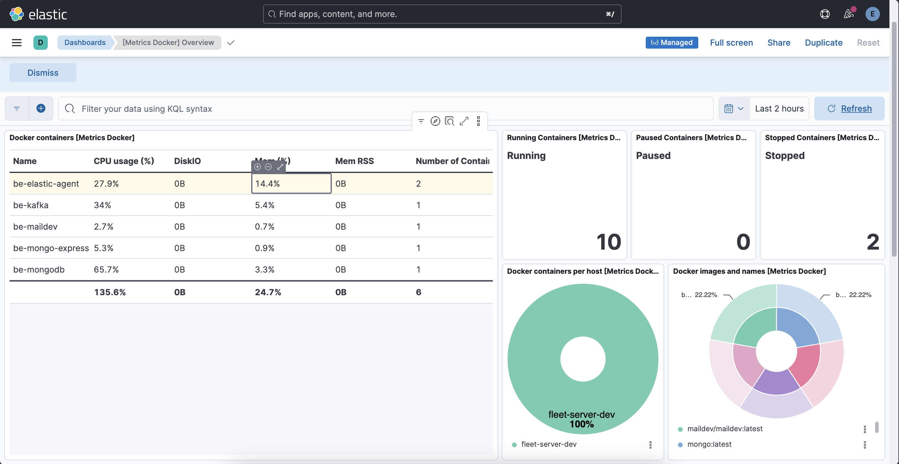
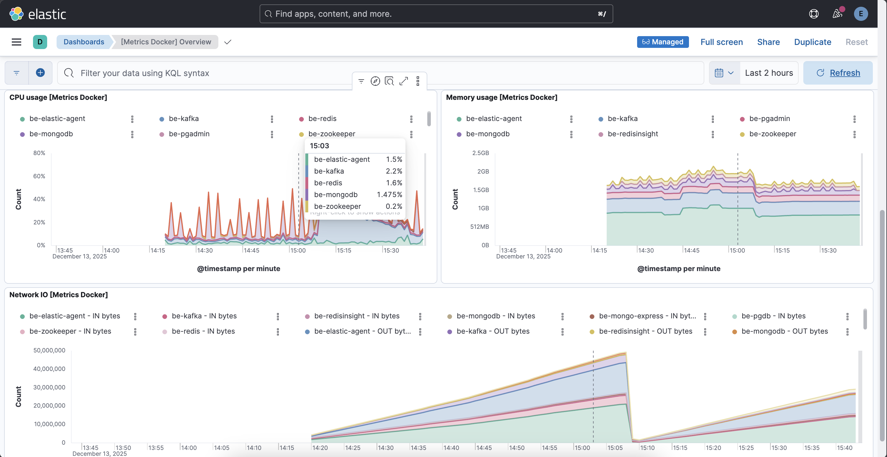

# Kibana Integrations - Docker 

The `database` and other `infrastructure tools` are built and run with `docker compose` in the project. 
- `postgres` 
- `pgadmin`
- `mongodb`
- `mongo-express`
- `zookeeper`
- `kafka`
- `maildev`
- `redis`
- `redis-insight`
- `elastic-agent`

`Docker Integration` handles collecting `metrics` for `docker containers`. 

Collecting `logs` and `metrics`:
- `Infrastructure (Redis, Kafka, MongoDB, PostgreSQL) logs`: `Docker Desktop Dashboard` or `terminal`
- `Infrastructure metrics (CPU/Memory)`: `Kibana integrations and dashboards`
- `Application logs (Java, Spring Boot services)`: `Kibana APM (Application Performance Monitoring)`

### Docker Integration

For that, go to `Kibana Server` &rarr; `Management` &rarr; `Fleet`. The `agent policy` for our running `Elastic Agent` instance is `Fleet Server Policy`. Open it. 

Click `Add Integration` there. It displays the list of all `Kibana Integrations`. Search for `Docker` there and select it. 

The `Docker integration` collects `metrics` and `logs` from `Docker containers`. The default `data streams` for `metrics` collection are: `container`, `cpu`, `diskio`, `healthcheck`, `info`, `memory` and `network`. 

Click `Add Docker`.

### Configure Integration

- Integration name: `docker-instance`
- Description: `Infrastructure and database tools running on docker.`
- Collect docker metrics: `enabled`
- Collect Docker logs: `disabled`
- To: `Existing hosts`
- Agent Policy: `Fleet Server Policy`

Keep other default configurations same. Save and deploy the integration.

Go to `Dashboards` &rarr; `[Metrics Docker] Overview`

