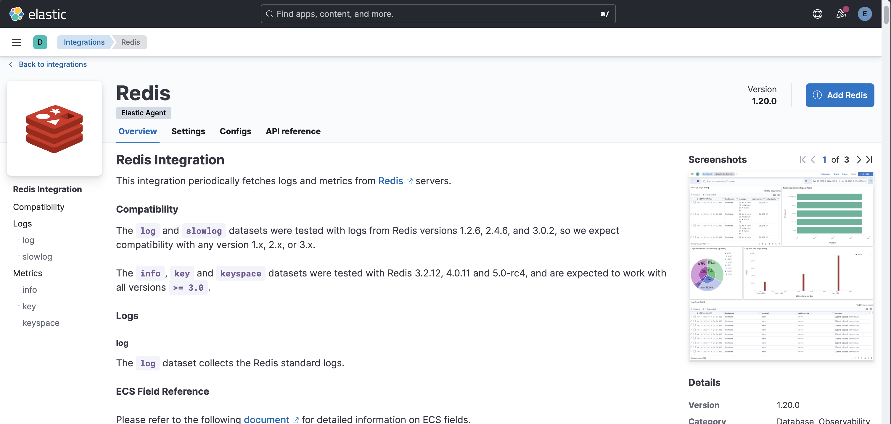
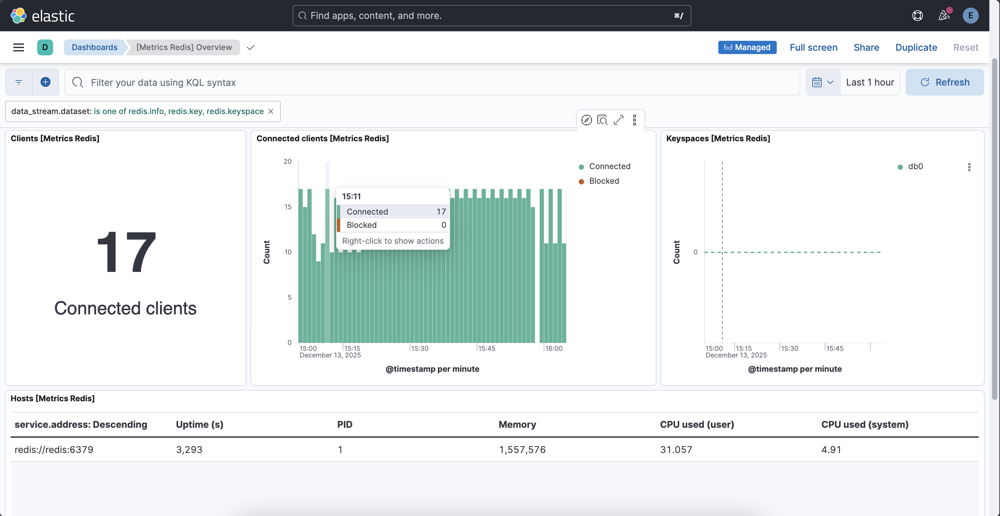

# Kibana Integrations - Redis 

`Redis` is used for `auth` service and `basket` service in the project. `Kibana Integration` for `Redis` periodically fetches `logs` and `metrics` from `Redis` servers.

### Redis Integration

For that, go to `Kibana Server` &rarr; `Management` &rarr; `Fleet`. The `agent policy` for our running `Elastic Agent` instance is `Fleet Server Policy`. Open it. 

Click `Add Integration` there. It displays the list of all `Kibana Integrations`. Search for `Redis` there and select it. 

Click `Add Redis`.

### Configure Integration

- Integration name: `redis-instance`
- Collect Redis metrics: `enabled`
- Collect Redis logs: `disabled`
- To: `Existing hosts`
- Agent Policy: `Fleet Server Policy`

Keep other default configurations same. Save and deploy the integration.

Go to `Dashboards` &rarr; `[Metrics Redis] Overview`

It collects and displays other metrics here.