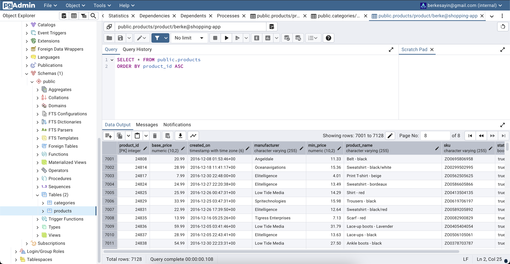
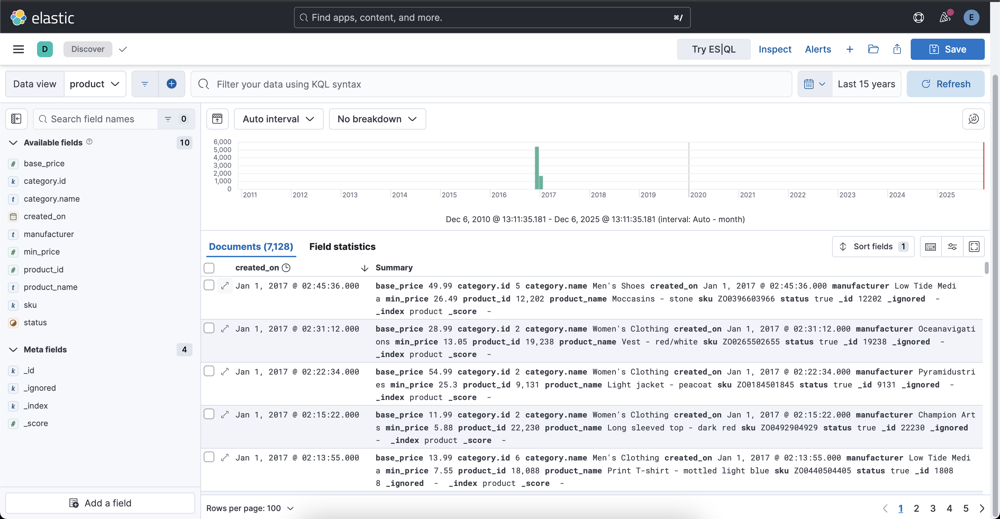

# Extract Elasticsearch Product Index Data To PostgreSQL Products Table

Elastic's sample e-commerce data contains products, categories, customers and orders information. For this project, `product`, `category` data is extracted to new `Elasticsearch indices` to utilize for different functionalities. 

And also `product` and `category` data is extracted as new `products` and `categories` tables at `PostgreSQL` database. 

For `product` and `category` data:
- Primary Database: `PostgreSQL`
- Secondaray Data Store: `Elasticsearch` for search and analysis

- For example, when new `product` created with `status 0`, it will only be saved at `PostgreSQL products` table.

- If a `product's`  status is updated to `1`, it will also be sent to `product` index at `Kibana` with `Kafka ProductStatusUpdated` event.

- If a new `product` is created with status `1`, it will first be saved at `PostgreSQL` and then be sent to 
`product` index at `Kibana` with `Kafka ProductPublished` event.

`PostgreSQL`



`Elasticsearch`



### Product Database 

Make sure `product` database exists with `products` and `categories` table when `product` service is built and run.

### Product Data 

There is a [Spring Boot project](https://github.com/berkesayin/product-data-postgresql) to have `products` table and `categories` table  `PostgreSQL product` database. Clone it.

```sh 
git clone https://github.com/berkesayin/product-data-postgresql.git
```

Locate to the project at terminal.

```sh
cd /path/to/product-data-postgresql
```

Create a `.env` file at root of the project. And put your values.

```
ELASTICSEARCH_USERNAME=<your_elastic_user>
ELASTICSEARCH_PASSWORD=<your_elastic_password>
```

### Extract Product and Category Data

- The application will automatically extract and process `product` and `category` data.

- Make sure your `Elasticsearch` instance is running on `localhost:9200`. 

Build the project.

```sh 
mvn clean install
```

Run the project.

```sh 
mvn spring-boot:run
```

Products and categories are extracted from Elasticsearch `product` index and `category` index. 

They are saved at `products` table and `categories` table at `PostgreSQL` It can be viewed at `PgAdmin`.