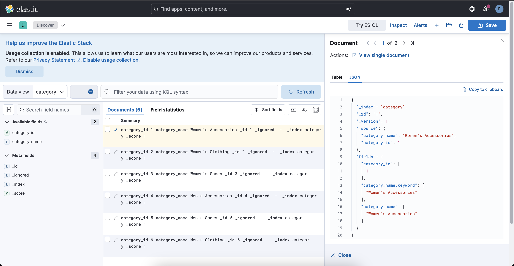

# Extract Elastic's E-Commerce Data To Category Index

Elastic's sample e-commerce data contains products, categories, customers and orders information. For this project, `product`, `category` and `customer` data is extracted to new `Elasticsearch indices` to utilize for different functionalities. 



### Create Category Index 

Open `Kibana Server` &rarr; `Management` &rarr; `Dev Tools` and run this command.

```json 
PUT /category
{
  "settings": {
    "number_of_shards": 1,
    "number_of_replicas": 1
  },
  "mappings": {
    "properties": {
      "category_id": {
        "type": "integer"
      },
      "category_name": {
        "type": "text",
        "fields": {
          "keyword": {
            "type": "keyword",
            "ignore_above": 256
          }
        }
      }
    }
  }
}
```

Response 

```json 
{
  "acknowledged": true,
  "shards_acknowledged": true,
  "index": "category"
}
```

Add `Data View` for this `category` index. For that go to `Kibana Server` &rarr; `Discover`. And create a new `Data View` here:

- Name: `category`
- Index pattern: `category` 

These are fields for `category` index:

- category_id 
- category_name

Meta fields: 

- _id 
- _ignored 
- _index 
- _score

### Category Data 

There is a [Spring Boot project](https://github.com/berkesayin/product-data-elasticsearch) to have `product` index and `category` index with documents at `Elasticsearch`. Clone it.

```sh 
git clone https://github.com/berkesayin/product-data-elasticsearch.git
```

Locate to the project at terminal.

```sh
cd /path/to/product-data-elasticsearch
```

Create a `.env` file at root of the project. And put your values.

```
ELASTICSEARCH_USERNAME=<your_elastic_user>
ELASTICSEARCH_PASSWORD=<your_elastic_password>
```

This is `application.yml` file:

```yml
spring:
  application:
    name: product-data
elasticsearch:
  username: ${ELASTICSEARCH_USERNAME}
  password: ${ELASTICSEARCH_PASSWORD}
extract:
  products:
    enabled: false
  categories:
    enabled: true
```

### Extract Category Data

- The application will automatically extract and process `category` data if the `extract.categories.enabled` property is set to `true` in `application.yml`.

- Make sure your `Elasticsearch` instance is running on `localhost:9200`. 

Build the project.

```sh 
mvn clean install
```

Run the project.

```sh 
mvn spring-boot:run
```

Categories are extracted from Elastic's `sample eCommerce orders data` and indexed to `category` index at `Elasticsearch`. It can be viewed ad `category` data view at `Kibana`.