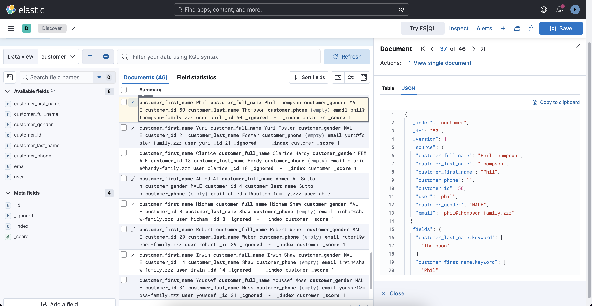

# Extract Elastic's E-Commerce Data To Customer Index

Elastic's sample e-commerce data also contains customers information. 

While `customer` data is not necessary for search and analysis functionalities, it can be useful to have `customer` data to use at backend endpoints. So, this part is optional.



### Create Customer Index 

Open `Kibana Server` &rarr; `Management` &rarr; `Dev Tools` and run this command.

```json 
PUT /customer
{
  "settings": {
    "number_of_shards": 1,
    "number_of_replicas": 1
  },
  "mappings": {
    "properties": {
      "customer_first_name": {
        "type": "text",
        "fields": {
          "keyword": {
            "type": "keyword",
            "ignore_above": 256
          }
        }
      },
      "customer_full_name": {
        "type": "text",
        "fields": {
          "keyword": {
            "type": "keyword",
            "ignore_above": 256
          }
        }
      },
      "customer_gender": {
        "type": "keyword"
      },
      "customer_id": {
        "type": "keyword"
      },
      "customer_last_name": {
        "type": "text",
        "fields": {
          "keyword": {
            "type": "keyword",
            "ignore_above": 256
          }
        }
      },
      "customer_phone": {
        "type": "keyword"
      },
      "email": {
        "type": "keyword"
      },
      "user": {
        "type": "keyword"
      }
    }
  }
}
```

Response 

```json 
{
  "acknowledged": true,
  "shards_acknowledged": true,
  "index": "customer"
}
```

Add `Data View` for this `customer` index. For that go to `Kibana Server` &rarr; `Discover`. And create a new `Data View` here:

- Name: `customer`
- Index pattern: `customer` 

These are fields for `customer` index:

- customer_first_name
- customer_full_name 
- customer_gender
- customer_id
- customer_last_name
- customer_phone
- email
- user

Meta fields: 

- _id 
- _ignored 
- _index 
- _score

### Customer Data 

There is a [Spring Boot project](https://github.com/berkesayin/customer-data-elasticsearch) to have `customer` index with documents at `Elasticsearch`. Clone it.

```sh 
git clone https://github.com/berkesayin/customer-data-elasticsearch.git
```

Locate to the project at terminal.

```sh
cd /path/to/customer-data-elasticsearch
```

Create a `.env` file at root of the project. And put your values.

```
ELASTICSEARCH_USERNAME=<your_elastic_user>
ELASTICSEARCH_PASSWORD=<your_elastic_password>
```

### Extract Customer Data

- The application will automatically extract and process `customer` data.

- Make sure your `Elasticsearch` instance is running on `localhost:9200`. 

Build the project.

```sh 
mvn clean install
```

Run the project.

```sh 
mvn spring-boot:run
```

Customers are extracted from Elastic's `sample eCommerce orders data` and indexed to `customer` index at `Elasticsearch`. It can be viewed ad `customer` data view at `Kibana`.