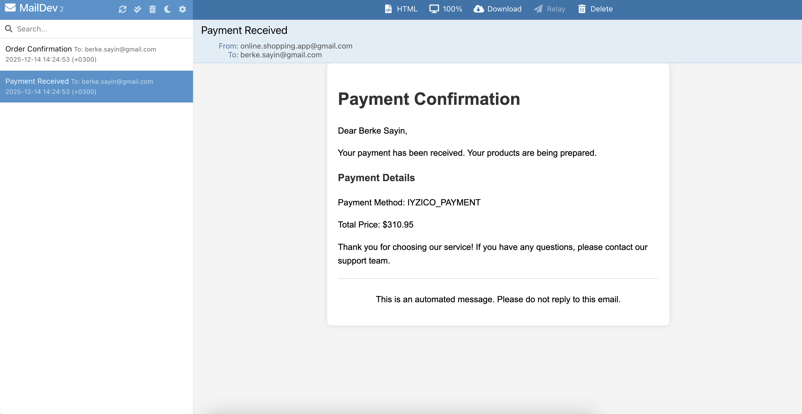

# Notification Service

`Notification` service manages sending mails to customers when `payment` is received and `order` is confirmed. 

### Build and Run Notification Service

Make sure `docker containers`, `config-server` and `discovery` service are running.

Build the `notification` service. For that locate to `notification` at terminal: `cd services/notification`

```sh 
mvn clean install
```

Run the service.

```sh 
mvn spring-boot:run
```

### DevMail For Order And Payment Mails

`Order Confirmation`


`Payment Received`



